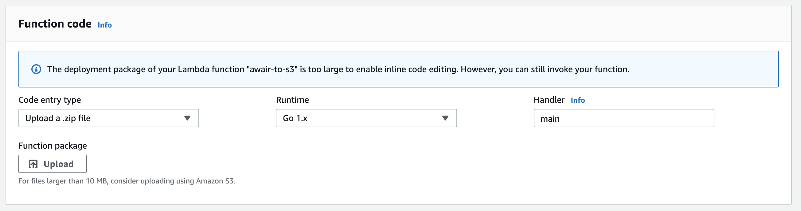
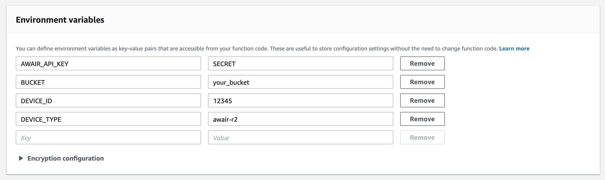

# Awair Lambda

This repo contains Go code for a Lambda function that pulls raw data from the
Awair API and saves CSV files to S3.

# Configuration

Create a new Lambda function called **awair-to-s3** (if you want to name it something else, you'll have to update **main.go**). This is how the Lambda function should be configured.



You'll need to configure the following environment variables in Lambda:

- `AWAIR_API_KEY`
  After joining the [Awair developer
  program](https://developer.getawair.com/onboard/welcome), you can get an [access
  token](https://developer.getawair.com/console/access-token) for pulling data for
  your device.
- `BUCKET`
  The script uses an S3 bucket to store both the compiled function binary and the
  air quality data. The function code is stored at `lambda/awair-to-s3.zip`, and
  the CSV files are stored at `airdata/[TIMESTAMP].csv`.
- `DEVICE_TYPE`
  Both device type and ID can be found by [listing out
  devices](https://docs.developer.getawair.com/?version=latest#26ca616d-b6e6-4647-a07d-5c90a23b7afe)
  through the API.
- `DEVICE_ID`



# Deploying

After configuring the function in Lambda, you can use `deploy.sh` to compile the
code, upload it to S3, and update the function to use it. The `BUCKET` variable
should be updated. You'll need AWS command line tools and Go installed.

# Querying

The function runs once per hour and saves a new CSV file with three columns:
timestamp, sensor, and value. Here's what that looks like:

```
2020-01-01 16:59:55.817000,temp,23.809999465942383
2020-01-01 16:59:55.817000,humid,32.84000015258789
2020-01-01 16:59:55.817000,co2,829
2020-01-01 16:59:55.817000,voc,137
2020-01-01 16:59:55.817000,pm25,3
```

With this date format Athena can query this directly from S3.
